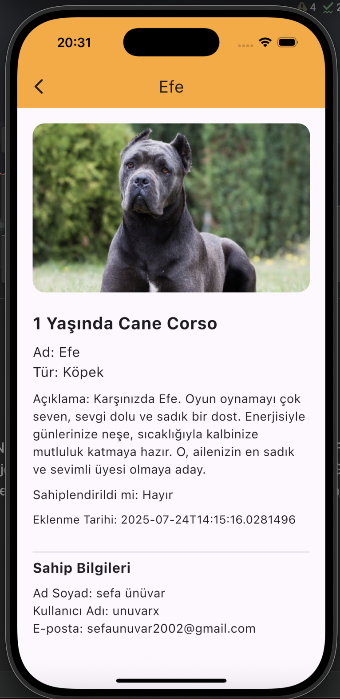

# Proje Adı: [Buraya Proje Adını Yazın]

Bu proje, hayvan sahiplendirmek için oluşturulmuş bir topluluk platformudur.

## Kullanılan Teknolojiler
* [Teknoloji 1]
* [Teknoloji 2]
* [Teknoloji 3]

## Kurulum ve Çalıştırma
Projeyi kendi bilgisayarınızda çalıştırmak için aşağıdaki adımları izleyin:

1.  Bu repoyu klonlayın: `git clone [REPO_URL]`
2.  Proje dizinine gidin: `cd [PROJE_KLASORU]`
3.  Gerekli paketleri yükleyin: `npm install` (veya `dotnet restore`, `pip install -r requirements.txt`)
4.  Projeyi başlatın: `npm run dev` (veya `dotnet run`)

## Ekran Görüntüleri

